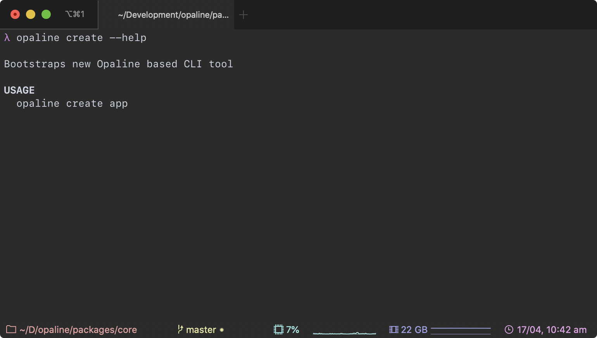

<br/>
<br/>
<div align="center">
  
</div>
<br/>
<br/>
<h2 align="center">Opaline – CLI Tools Framework</h2>
<br/>


**Opaline** — a CLI tools framework and compiler. It draws inspiration from [NextJS](https://nextjs.org/)(and similar projects) and provides a quick, convention based, way of creating CLI tools.

1. It looks for files in `./commands` folder and treats them as commands for a CLI:

   - ```
     commands
     └── build.ts

     # Means it can be run as following:
     λ cli build
     ```

2. Command file must export a function (can be async function too):
   - ```js
     export default function myCommand() {}
     // or
     module.exports = async function myCommand() {};
     ```
3. Uses JSDoc to describe parameters and documentation for a CLI. Read more on supported JSDoc syntax and how to use it [here](#jsdoc).

## Table of Contents

- [Table of Contents](#table-of-contents)
- [Usage](#usage)
- [Creating Commands](#creating-commands)
  - [Adding Command Parameters and Documentation](#adding-command-parameters-and-documentation)
- [JSDoc](#jsdoc)
  - [Supported JSDoc Tags](#supported-jsdoc-tags)
  - [Extra JSDoc Tags](#extra-jsdoc-tags)
- [package.json](#packagejson)
  - [package.json#bin](#packagejsonbin)
  - [package.json#description](#packagejsondescription)
- [Examples](#examples)
- [Screenshots](#screenshots)

## Usage

Use a generator to bootstrap an **Opaline** based CLI:

```sh
λ npx @opaline/core create app
λ cd app
λ npm install
```

Compile the CLI:

```sh
λ npm run build
λ npm run dev # for dev mode with watch and auto linking
```

## Creating Commands

By default generator creates `commands/index.js` file, which is a default command, and can be run without specifying a command name:

```
λ cli --param1 20
```

But if required there might be multiple commands in one CLI. In order to do that, we just need to create another file in `./commands` folder (or rename `index.js`, it's not required to have a default command):

```js
// ./commands/build.js

export default function build() {
  console.log("hello build!");
}
```

### Adding Command Parameters and Documentation

Opaline uses JSDoc to define parameters and documentation for a command:

```js
// ./commands/build.js

/**
 * Description of a command is just a comment above the command's function.
 * Params are described as JSDoc params:
 *
 * @param {string} name Name of an app to build
 * @param {string} [lang="TypeScript"] A parameter with default value
 */
export default function build(name, lang) {
  console.log(`hello ${name}, language ${lang}`);
}
```

Help will be generated for both default and this new command:

```
λ examples-for-docs --help # help for the whole cli, with list of commands

VERSION
  examples-for-docs/0.0.0

USAGE
  examples-for-docs inputs --param1 10 --param2 20

COMMANDS
  build     Description of a command is just a comment above the command's function. Params are described as JSDoc params:

> NOTE: To view the usage information for a specific command, run 'examples-for-docs [COMMAND] --help'

OPTIONS
  --param1      Some parameter for a CLI with a default value [number] [default: 20]
  --param2      Some parameter for a CLI [string]
  --help        Output usage information
  --version     Output the version number


λ examples-for-docs build --help # help for a subcommand

Description of a command is just a comment above the command's function. Params are described as JSDoc params:

OPTIONS
  --name     Name of an app to build [string]
  --lang     A parameter with default value [string] [default: "TypeScript"]
```

## JSDoc

> **Opaline** uses JSDoc to describe command's parameters and documentation.

### Supported JSDoc Tags

| Tag                                          | Description                                                                               |
| -------------------------------------------- | ----------------------------------------------------------------------------------------- |
| `@param` – https://jsdoc.app/tags-param.html | Supports primitive types: `string`, `number`, `boolean`. And arrays of strings `string[]` |
| `@example`                                   | **Note: only one line examples**: `@example {cliName} --params 10`                        |

### Extra JSDoc Tags

| Tag         | Description                                                                                                                  |
| ----------- | ---------------------------------------------------------------------------------------------------------------------------- |
| `@usage`    | Similar to example, but outlines the main example on how to use a CLI command. `@usage {cliName} build`                      |
| `{cliName}` | A variable that will be replaced by the name of a CLI tool described in `package.json`. Supported by `@usage` and `@example` |

## package.json

Opaline gets multiple things from a `package.json` file, to even more reduce configuration:

### package.json#bin

https://docs.npmjs.com/files/package.json#bin

There are 2 way of using the `bin` field in `package.json`:

```js
// 1
{
  "name": "cli-name",
  "bin": "./cli/cli.js"
}

// 2
{
  "name": "cli-name",
  "bin": {
    "cli-name": "./cli/cli.js"
  }
}
```

**Opaline** supports both of them. And uses those fields in a following way:

1. Path to a CLI file – For both cases the file path is used as an output target for a CLI entry point, **and will be automatically created by Opaline, no need to manually create it.**
2. Name of a CLI – For [1] the name will be `package.json#name`, if you need to have a different name than the name of a package, use an option 2. Name is used as `{cliName}` in JSDoc and also when linking packages in dev mode. Which makes them accessible globally, by this name:
   - `cli-name [COMMAND]`

### package.json#description

Used as main description for a CLI tool.

## Examples

Tools built with **Opaline**:

- [Opaline CLI itself](https://github.com/d4rkr00t/opaline/tree/master/packages/core/commands)
- [Example Choose Reviewer Tool](https://github.com/d4rkr00t/review-tools)

## Screenshots



